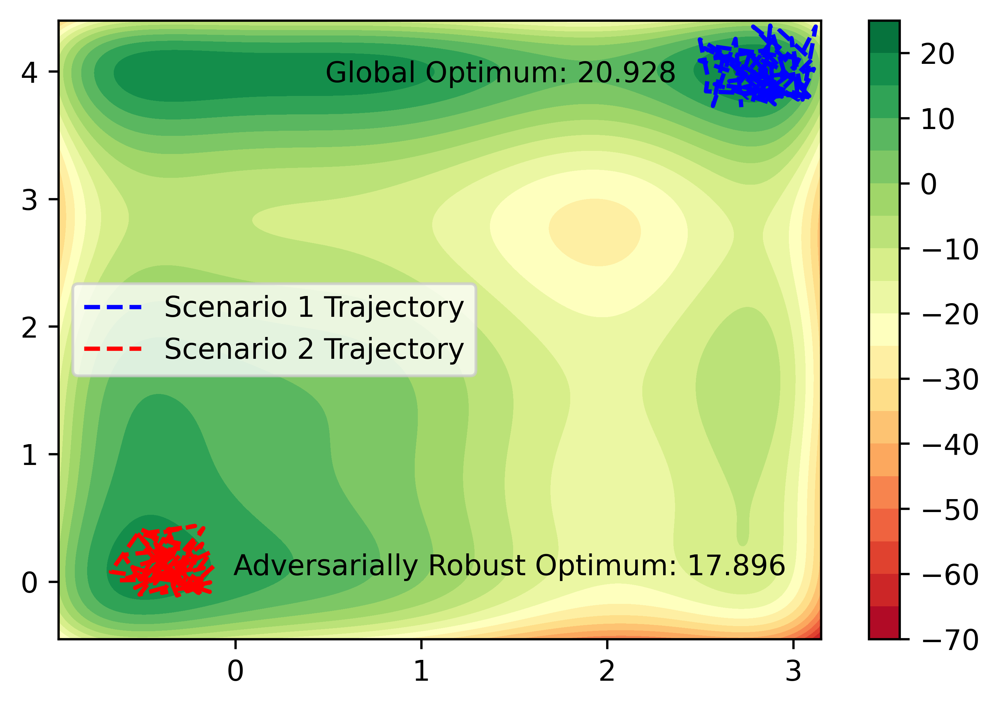

<!--more-->

 | 
--- | ---

Real-Time Optimization (RTO) plays a crucial role in the process operation hierarchy by determining optimal set-points for the lower-level controllers. However, at the control layer, these set-points may be difficult to track due to challenges in implementation as a result of disturbances, measurement noise, and actuator performance limitations. To address this, we introduced the Adversarially Robust Real-Time Optimization and Control (ARRTOC) algorithm. ARRTOC addresses this issue by finding set-points which are both optimal and inherently robust to implementation errors at the control layers. ARRTOC draws inspiration from adversarial machine learning, offering a novel constrained Adversarially Robust Optimization solution applied to the RTO layer. By integrating controller design with RTO, ARRTOC enhances overall system performance and robustness by ensuring the chosen set-points are tailored to the underlying controller designs. This concept is best illustrated visually as per the attached figures, where the performance of a controller around two possible set-points is compared: the global optimum (scenario 1 in blue) and the adversarially robust optimum (scenario 2 in red). We observe that, paradoxically, operating at the adversarially robust optimum yields a 30% larger mean objective value compared to operating at the global optimum due to its inherent robustness.

[Link to publication.](https://arxiv.org/abs/2309.04386)