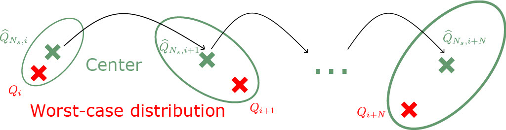

<!--more-->

 | 
--- | ---

Data-driven distributionally robust MPC (DRMPC) is an optimal control scheme, which - instead of considering only one distribution as in SMPC - determines control actions with respect to the worst-case distribution from a set of distributions (the set is known as ambiguity set). The research mainly focuses on: 

- Exact reformulations of underlying distributionally robust optimisation problems for the purpose of computational efficiency.
- Proofs of stability and convergence. 
- Propagation of ambiguity sets in dynamical systems.

[Nonlinear Wasserstein Distributionally Robust Optimal Control](https://icml.cc/virtual/2023/26516)

[Tube-based distributionally robust model predictive control for nonlinear process systems via linearization](https://www.sciencedirect.com/science/article/pii/S0098135422004458)