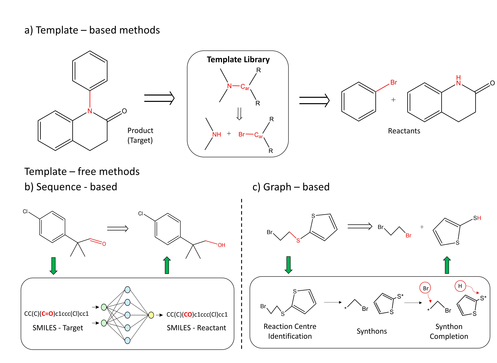

<!--more-->

 | 
--- | ---

Synthesizing organic molecules in a sustainable way is a decisive factor towards accelerated drug discovery. Finding synthesis pathways from potential reactants towards the molecule or product of interest is challenging. Traditionally, expert chemists use their own intuition to find potential disconnection sites in the product molecule to arrive at one or more reactant intermediates. These intermediates are subject to further inspection to finally arrive at reactants (building blocks) that can be purchased off-shelf. The iterative process from the molecular product to building blocks is formally known as retrosynthesis. To aid scientists in this endeavor, researchers have proposed a variety of computational tools based on heuristics, reaction rules, or data-driven approaches. Within recent years, machine learning (ML) has received tremendous attention for retrosynthesis. While ML algorithms are seen to be successful at proposing viable synthesis routes towards simpler molecules, there are many remaining challenges until these techniques will have a significant impact on molecular synthesis and discovery. The interested reader is referred to the references below.

#### Related Publications

[1] Hastedt F, Bailey RM, Hellgardt K, Yaliraki SN, del Rio Chanona EA, Zhang D. Investigating the Reliability and Interpretability of Machine Learning Frameworks for Chemical Retrosynthesis. ChemRxiv. 2024; doi:10.26434/chemrxiv-2024-qdgnv-v3 

[2] Segler, M., Preuss, M. & Waller, M. Planning chemical syntheses with deep neural networks and symbolic AI. Nature 555, 604–610 (2018). https://doi.org/10.1038/nature25978 

[3] Connor W. Coley et al., A robotic platform for flow synthesis of organic compounds informed by AI planning.Science365,eaax1566(2019) DOI:10.1126/science.aax1566 

[4] Tu, Z., Stuyver, T., & Coley, C. (2023). Predictive chemistry: machine learning for reaction deployment, reaction development, and reaction discovery. Chemical Science, 14(2), 226–244.
